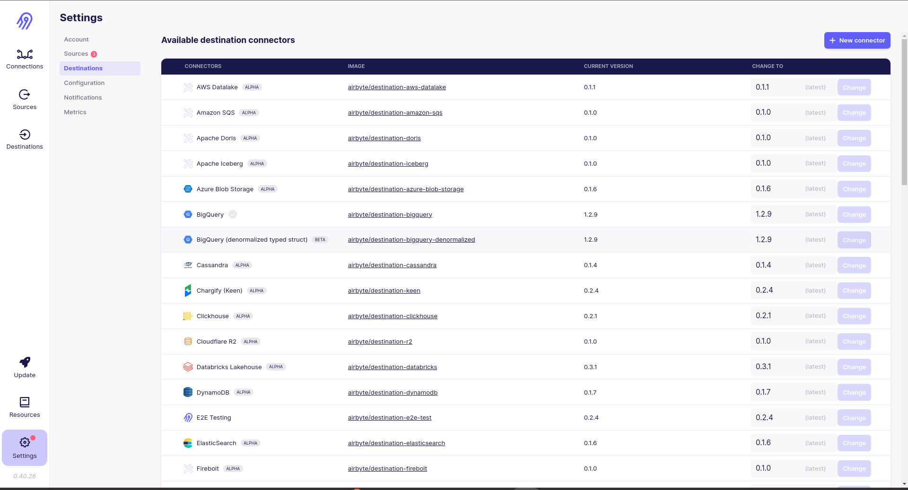
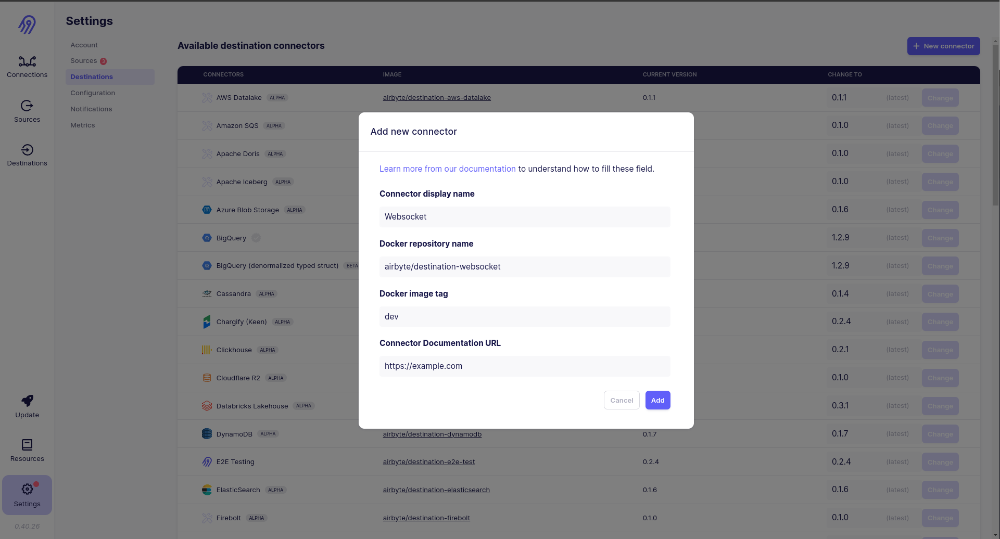

# Hurb Airbyte Local
  
This repository contains instructions for running airbyte locally for testing connectors.
  
### Prerequisites  
**To interact with airbyte locally , make sure to complete this prerequisites section.**

#### A linux amd64 environment is required. We may add support for other architectures such as arm64 and MacOS operating system in the future.

#### Install dependencies
Run the following shell script to install the dependencies (minikube, helm and airbyte helm repo):
```
cd scripts/
bash install_local_dependencies.sh
```

### Locally running the airbyte
This script starts minikube, installs and run airbyte for local access. If minikube and airbyte are already running, just print the url for access:

```
cd scripts/
bash run_local_airbyte.sh
```

Go to airbyte url: http://localhost:8000  

### Developing a custom connector
Airbyte allows us to create custom connectors to contribute to the official project. In this case I am presenting an architecture considering that they are unofficial connectors that only Hurb will use.

To contribute to the official airbyte there is already documentation that explains how to create a connector. https://docs.airbyte.com/contributing-to-airbyte/

To create an unofficial connector, I suggest each connector is in a separate github repository to take advantage of github version control. A monorepo is also an option, but I've considered using separate repositories to get separate versions and release notes.

The steps are: create a github repo, use the airbyte generate.sh script to create connector base code and copy folder to connector github repo.

#### Generating a connector written in python

Clone the airbyte github repo:

```
git clone https://github.com/airbytehq/airbyte.git
```

Follow the steps in the documentation to use the generate.sh script:

- SOURCE: https://docs.airbyte.com/connector-development/tutorials/building-a-python-source
- DESTINATION: https://docs.airbyte.com/connector-development/tutorials/building-a-python-destination

Copy the connector folder content that was generated to the custom connector github repo and CODE! :)

#### I developed a custom destination connector (send data to websockets) containing CI/CD and documentation. When committing to this project, we must use tags to control the versions that will be generated by Semantic Release. When opening a PR, the tests are executed, when merged in the main, the version will be generated and the docker image that will be sent to Dockerhub.
#### REPO: https://github.com/alexsanderp/hurb-airbyte-connector-destination-websocket

### Locally using the custom connector in Airbyte (minikube)  

If you want to test a connector that is already publicly available on dockerhub, skip the step of build and skip the step of load the docker image on minikube.


#### Build  
```
cd YOUR_CONNECTOR_GITHUB_REPO/
docker build -t airbyte/(destination or source)-YOUR_CONNECTOR_NAME:dev .  
```
 
#### Load  

Send your custom connector docker image (local) to minikube:

Example:
```  
minikube image load airbyte/(destination or source)-YOUR_CONNECTOR_NAME:dev 
```  
 
#### Using

Go to airbyte url: http://localhost:8000  
  
Go to Settings > Destinations or Sources
  
  
Click in New connector and register the docker image  
  
  
Now create a new source or destination with the connector parameters.
  
Create a pipeline using your source or destination to test :)

### Reset Airbyte

Run command:

```
minikube delete
```

And run AGAIN: 

```
cd scripts/
bash run_local_airbyte.sh
```